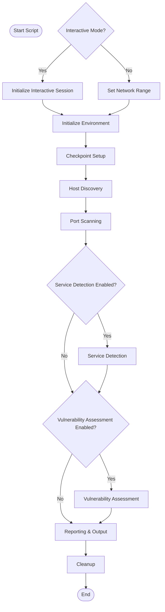

# Enhanced Network Scanner v2.0

A comprehensive PowerShell-based network scanning tool with advanced vulnerability assessment, intelligent resource management, and detailed reporting capabilities.

## Features

### 🔍 **Advanced Network Discovery**
- **Multi-Method Host Discovery**: ICMP, TCP, UDP, and ARP-based discovery
- **Intelligent Fallback**: Automatically switches methods when ICMP is blocked
- **Auto-Detection**: Automatically detects local network ranges
- **Flexible Range Support**: Supports CIDR notation for network ranges

### 🚀 **High-Performance Scanning**
- **Intelligent Threading**: Auto-calculates optimal thread count based on system resources
- **Memory Management**: Built-in memory monitoring and garbage collection
- **Performance Profiling**: Real-time performance metrics and optimization
- **Resource Efficiency**: Adaptive thread management prevents system overload

### 🔒 **Comprehensive Security Assessment**
- **Vulnerability Detection**: Identifies common security issues and misconfigurations
- **Service Fingerprinting**: Advanced banner grabbing and service identification
- **Port Analysis**: Scans for open ports and running services
- **Risk Assessment**: Categorizes vulnerabilities by severity levels

### 📊 **Professional Reporting**
- **HTML Reports**: Modern, compact, and fully interactive HTML reports with:
  - Sortable and filterable columns for all data fields
  - Print-optimized layout (no clipped tables, minimal blank space)
  - Responsive, flexible design with minimal margins
  - Column alignment and widths that match header and data
  - Visual status indicators and vertical split lines
- **Real-time Logging**: Comprehensive logging with multiple verbosity levels
- **Export Options**: HTML, CSV, and optional JSON for integration with other tools
- **Email Notifications**: Optional email alerts for scan completion and critical findings

### 🎛️ **User-Friendly Interface**
- **Interactive Mode**: Guided setup with intelligent defaults
- **Command-Line Interface**: Full scriptable automation support
- **Progress Tracking**: Real-time scan progress and ETA calculations
- **Flexible Configuration**: Extensive customization options


## Core Infrastructure Map (Region 2)

This region provides the foundational building blocks for the script, supporting all other modules:

| Component              | Function(s)                       | Purpose                                    |
|------------------------|------------------------------------|--------------------------------------------|
| Logging System         | `Write-Log`, `Initialize-LoggingSystem` | Centralized logging, color/file output      |
| Performance Monitoring | `Start-PerformanceMonitoring`, `Stop-PerformanceMonitoring` | Memory/resource monitoring, auto-GC         |
| Error Handling         | `Invoke-ErrorHandler`              | Consistent error handling and logging       |
| System Diagnostics     | `Test-SystemInformation`           | System info and diagnostics                 |

All functions are reusable and robust, designed to support the main scanning engine and all other script regions.

---

## Execution Timeline & Logic Diagram

```mermaid
gantt
    title Enhanced Network Scanner Execution Timeline
    dateFormat  HH:mm
    section Main Flow
    Environment Setup         :done,    env, 00:00, 1m
    Checkpoint Setup         :done,    chk, after env, 0.5m
    Host Discovery           :done,    host, after chk, 1m
    Port Scanning            :active,  port, after host, 2m
    Service Detection        :         svc,  after port, 1.5m
    Vulnerability Assessment :         vuln, after svc, 1.5m
    Reporting & Output       :         rep,  after vuln, 0.5m
    Cleanup                  :         clean, after rep, 0.2m
```




### Execution Logic (If-This-Then-That Diagram)



## Phases
- **Environment Setup**: Initializes logging, parameters, and diagnostics.
- **Checkpoint Setup**: Prepares temp files for resumability.
- **Host Discovery**: Identifies live hosts in the target range.
- **Port Scanning**: Scans discovered hosts for open ports.
- **Service Detection** (optional): Identifies services on open ports.
- **Vulnerability Assessment** (optional): Checks for known vulnerabilities.
- **Reporting & Output**: Generates HTML/CSV reports and sends notifications.
- **Cleanup**: Finalizes and cleans up resources.

---

## Requirements

- **PowerShell**: Version 5.1 or higher
- **Operating System**: Windows 10/11, Windows Server 2016+
- **Network Access**: Appropriate permissions for network scanning
- **Memory**: Minimum 4GB RAM recommended for large scans

## Quick Start

### Interactive Mode (Recommended for new users)
```powershell
# Download and run with auto-detection
.\Enhanced_Network_Scanner.ps1
```

### Command Line Examples
```powershell
# Basic network scan with auto-detection
.\Enhanced_Network_Scanner.ps1 -NetworkRange "192.168.1.0/24"

# Full security assessment
.\Enhanced_Network_Scanner.ps1 -NetworkRange "10.0.0.0/16" -EnableVulnScan -VerboseOutput

# Custom port scan with specific output location
.\Enhanced_Network_Scanner.ps1 -NetworkRange "172.16.0.0/12" -Ports @(80,443,22,21,3389) -OutputPath "C:\Scans"

# Aggressive discovery for stealth networks
.\Enhanced_Network_Scanner.ps1 -NetworkRange "192.168.0.0/24" -Discovery "Aggressive" -EnableVulnScan
```

## Parameters

| Parameter | Type | Description | Default |
|-----------|------|-------------|---------|
| `NetworkRange` | String | Network range in CIDR notation | Auto-detected |
| `Ports` | Int[] | Array of ports to scan | Common ports (80,443,22,etc.) |
| `OutputPath` | String | Output directory for reports | Current directory |
| `MaxThreads` | Int | Maximum concurrent threads | Auto-calculated |
| `Timeout` | Int | Network timeout in milliseconds | 2000 |
| `Discovery` | String | Host discovery method | "Both" |
| `EnableVulnScan` | Switch | Enable vulnerability assessment | False |
| `VerboseOutput` | Switch | Enable detailed logging | False |
| `Interactive` | Switch | Enable interactive mode | True |

## Discovery Methods

- **ICMP**: Traditional ping-based discovery (fast but often blocked)
- **TCP**: TCP connect probes to common ports (reliable)
- **Both**: ICMP first, fallback to TCP (recommended)
- **Aggressive**: Multiple techniques including UDP and ARP (thorough)

## Output Files

The scanner generates several output files:

- **HTML Report**: `NetworkScan_Report_YYYYMMDD_HHMMSS.html`  
  - Fully interactive: sortable/filterable columns, print-optimized, compact layout, and visually clear column alignment.
- **CSV Report**: `NetworkScan_Report_YYYYMMDD_HHMMSS.csv`  
  - Matches the HTML table data for easy import into Excel or other tools.
- **Log File**: `NetworkScan_YYYYMMDD_HHMMSS.log`
- **Raw Data**: Optional JSON exports (future)

## Performance Optimization

The scanner automatically optimizes performance based on:

- **CPU Cores**: Scales thread count with available processors
- **Available Memory**: Prevents memory exhaustion
- **Network Latency**: Adapts timeouts based on response times
- **Target Count**: Optimizes for scan size

### Manual Tuning
```powershell
# For high-performance systems
.\Enhanced_Network_Scanner.ps1 -NetworkRange "10.0.0.0/8" -MaxThreads 1000 -MemoryLimitMB 1024

# For resource-constrained systems
.\Enhanced_Network_Scanner.ps1 -NetworkRange "192.168.1.0/24" -MaxThreads 50 -MemoryLimitMB 128
```

## Security Considerations

- **Network Permissions**: Ensure you have authorization to scan target networks
- **Firewall Rules**: May trigger security alerts; coordinate with network administrators
- **Rate Limiting**: Use appropriate thread counts to avoid overwhelming target systems
- **Legal Compliance**: Only scan networks you own or have explicit permission to test

## Troubleshooting

### Common Issues

1. **"Access Denied" Errors**
   - Run PowerShell as Administrator
   - Check execution policy: `Set-ExecutionPolicy -ExecutionPolicy RemoteSigned -Scope CurrentUser`

2. **High Memory Usage**
   - Reduce thread count with `-MaxThreads` parameter
   - Lower memory limit with `-MemoryLimitMB` parameter

3. **No Hosts Discovered**
   - Try different discovery methods (`-Discovery "Aggressive"`)
   - Verify network connectivity and routing
   - Check firewall settings

4. **Slow Performance**
   - Increase thread count for faster scanning
   - Reduce timeout values for unresponsive networks
   - Use smaller network ranges for testing

### Debug Mode
```powershell
# Enable maximum verbosity for troubleshooting
.\Enhanced_Network_Scanner.ps1 -NetworkRange "192.168.1.0/24" -VerboseOutput
```

## Contributing

We welcome contributions! Please feel free to submit issues, feature requests, or pull requests.

### Development Setup
1. Fork the repository
2. Create a feature branch
3. Test your changes thoroughly
4. Submit a pull request with detailed descriptions

## License

This project is licensed under the MIT License - see the [LICENSE](LICENSE) file for details.

## Changelog


### Version 2.0 (July 2025)
- 🎉 **Major Release**: Complete rewrite with enhanced architecture
- ✨ **New Features**: Interactive mode, auto-detection, multi-method discovery
- 🚀 **Performance**: Intelligent threading and memory management
- 🔒 **Security**: Comprehensive vulnerability assessment framework
- 📊 **Reporting**: Modern, interactive HTML reports (sortable/filterable, print-optimized, compact, visually aligned columns)
- 🛠️ **Reliability**: Robust error handling and recovery mechanisms

### Previous Versions
- v1.x: Basic network scanning functionality

## Support

For support, feature requests, or bug reports:
- 📧 Create an issue on GitHub
- 📖 Check the documentation and examples above
- 🔍 Enable verbose output for detailed troubleshooting

## Acknowledgments

- PowerShell Community for excellent networking modules
- Security researchers for vulnerability assessment techniques
- Contributors and testers for feedback and improvements

---

**⚠️ Disclaimer**: This tool is for authorized network testing only. Users are responsible for compliance with applicable laws and regulations. Always obtain proper authorization before scanning networks you don't own.
